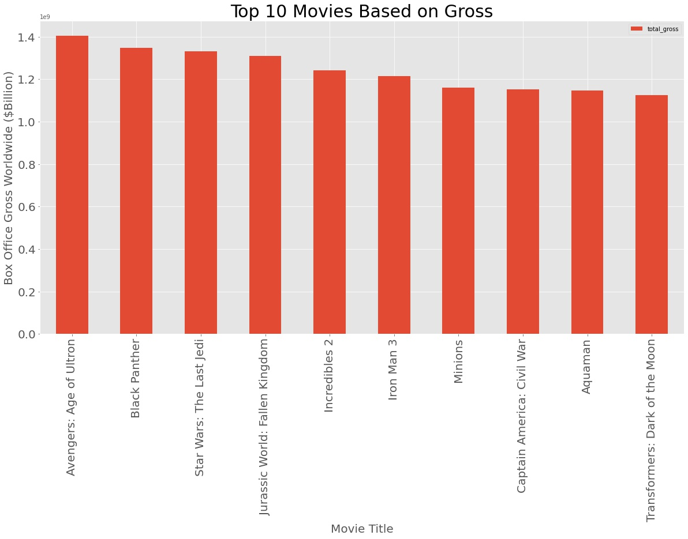
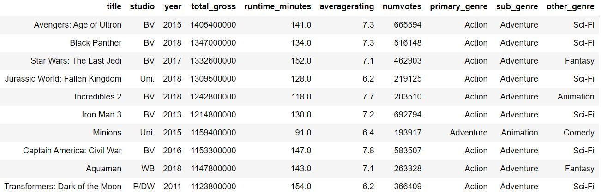
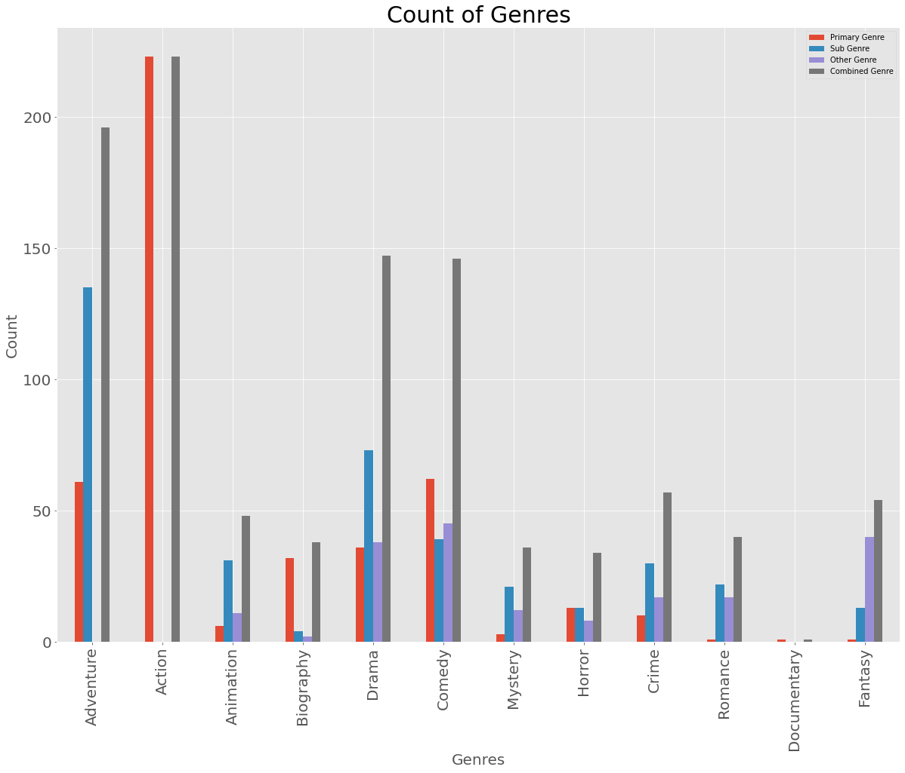

# Microsoft Movie Anaylsis - Project 1

**Author**: Scott Graham

## Overview

The goal of this analysis is to provide an insight for [Microsoft](https://www.microsoft.com/en-au/movies-and-tv?activetab=movies%3aprimaryr2) regarding the latest box office films and what is popular and most successful so they can leverage this information to provide quality content in their new movie studio. Detailed analysis of what is "hot or not" will ensure that resources are spent developing content that will be widely accepted and best return on investment for Microsoft.


## Business Problem

Microsoft need to provide movie content that is relevant with current trends, to ensure that their resource allocation is directed in the right direction to provide the best results. Using multiple databases from [IMDB](https://www.imdb.com/) to gain insights from the reviews of fans and critics to provide the best information about what is trending with Microsoft's intended audience. Supplemented with the current gross revenue information provided by [Box Office Mojo](https://www.boxofficemojo.com/chart/ww_top_lifetime_gross/) from 2010 to 2018.

Understanding what movies have made the highest gross at the box office worldwide, have the highest rating amongst fans and critics alike and the most popular genres from a profitability and review standpoint will provide Microsoft with the insight to direct resources to creating the best content possible.


## Data Understanding

[IMDB](https://www.imdb.com/) is one of the largest database for information relating to movies and TV series that includes information about the cast, crew, plot summaries, rating and reviews both critcal and fan-based.
Each review has a unique ID associated to the movie details and the ratings. The data files provides information on the studio that created the movie, the running time, the year it was released and genre.

[Box Office Mojo](https://www.boxofficemojo.com/chart/ww_top_lifetime_gross/) provides the lifetime highest gross movies and this dataset has been restricted from 2010 to present. This information will be useful to find the top grossing movies and insights we can make from why they are the top gross movies.

## Methods

Data cleaning involved:

● Removing symbols out of titles

● Dropping of columns

● Conversion of data types

● Separation of Genres

Merged all datasets together to provide best use of
information

Further data cleaning:

● Removal of NaN values

● Creation and deletion of columns

● Restriction of data based on gross and ratings

Modelling of data to suit business problem

## Results

Scatter plot to compare th number of votes with the average rating given. This provided a trend that the more votes a movie obtained the higher the rating typically was.


Showing the top 10 movies with the highest gross. 
90% of these top 10 were Action and Adventure films. 
60% of these top 10 were also from BV (Marvel) studio.




Action and Adventure movies were the most frequent. This was after the removal of all movies that fell below the mean total gross of all films AND also the removal of all movies that had a mean rating less than the the overall mean for the complete dataset. This was to negate any irrelevant data and outliers on the low end.



## Conclusions

● Prioritise the creation of Action and Adventure movies for the highest gross.

● Movies last greater than 100 minutes were seen in the top 10 gross and top 10 from ratings.

## Next Steps

● Data related to cost of creating movies would directly influence the current suggestions.

● Analysis didn’t provide any clear cut definitive to provide certainty in success of movies.

● Additional data would be required.


## For More Information

Please review our full analysis in the [Jupyter Notebook](./Microsoft_Movie_Analysis.ipynb) or review the [presentation](./Microsoft_Movie_Studio_Presentation.pdf).

For any additional questions, please contact **Scott Graham at scottgraham14@gmail.com**


## Repository Structure

Describe the structure of your repository and its contents, for example:

```
├── data                          
├── images   
├── Microsoft_Movie_Analysis.ipynb         
├── Microsoft_Movie_Studio_Presentation.pdf                                
└── README.md                              
```
