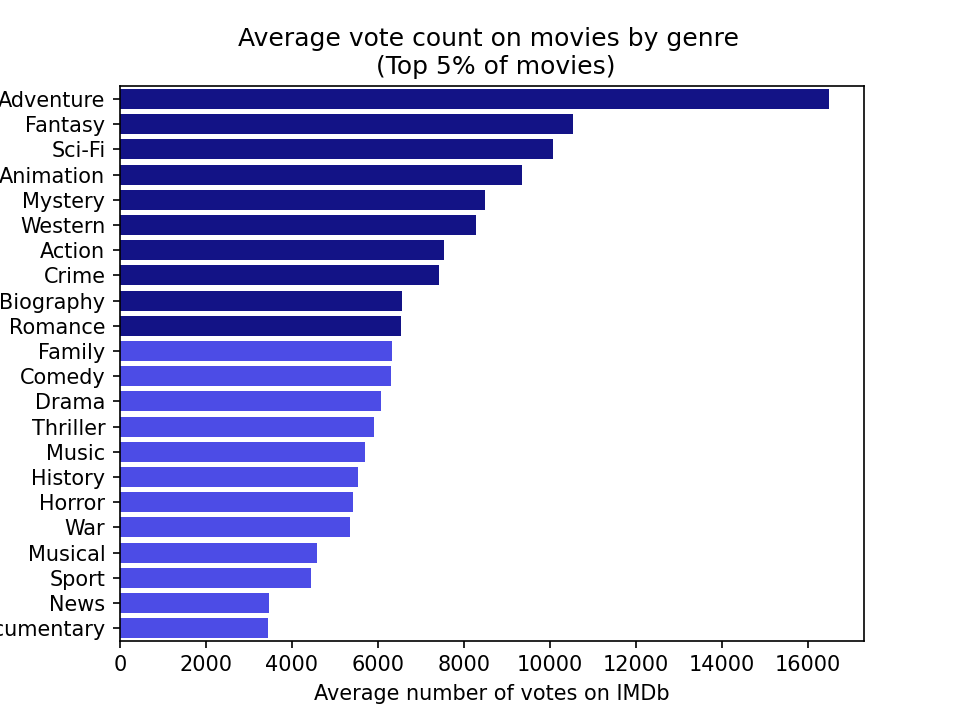
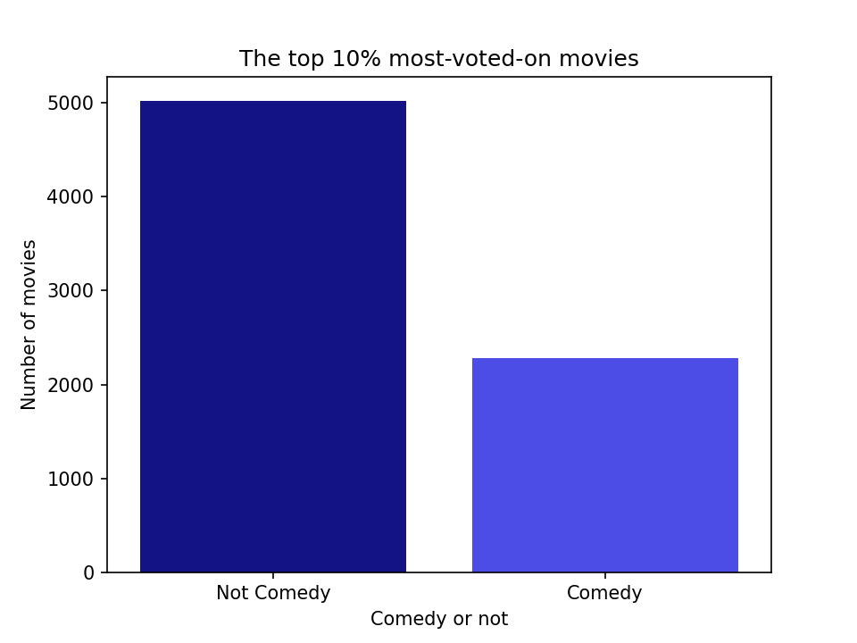
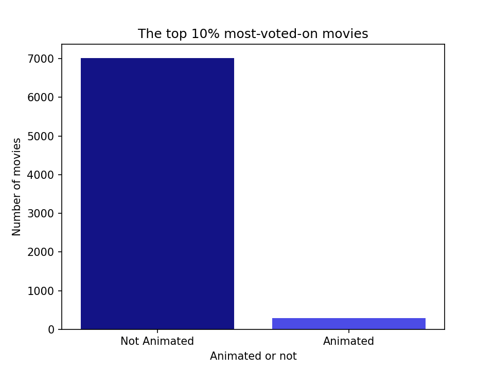

#  MICROSOFT MOVIE STUDIO MARKET RESEARCH
## Author: Winfred Kabuya

 ## Overview
This project aims to provide recommendations to Microsoft regarding the types of movies that perform well among audiences, using data analysis of movie ratings and popularity. Microsoft plans to launch its own movie studio and has requested guidance as a newcomer to the industry. The project utilizes datasets from various sources, such as Box Office Mojo, IMDb, Rotten Tomatoes, The Movie Database, and The Numbers. The primary focus of the analysis is the IMDb datasets, which include movie information from 2010 to 2019, such as genres, average user ratings, and the number of users who voted on each movie. The analysis resulted in identifying 10 high-performing genres for Microsoft to prioritize and providing recommendations on how much of its budget should be allocated to Action movies and animated movies.

## Business Problem
When measuring success in the movie industry, it may not be sufficient to only consider the attributes that generate the highest return-on-investment at the box office, especially in the streaming era. Rather, the number of people who watch the movie should be the primary measure of success. As Microsoft considers whether to sell its movies to streaming services or launch its own, it needs to determine which types of movies will attract the most viewers. To gauge this, I use the number of votes a movie receives on IMDb as a proxy for the number of viewers. By analyzing this metric, I aim to answer the following questions: which 5 genres typically perform the best, and how much focus should Microsoft place on producing comedies and action movies? 

## Data Understanding

IMDb is a highly popular website for obtaining basic information on movies and TV shows, including user reviews.As of March 2022, the database contained some 10.1 million titles (including television episodes) and 11.5 million person records. Additionally, the site had 83 million registered users and is the 54th most visited website in the world, according to website ranker Alexa as of February 12, 2023.

The data that I will be working with is stored in a SQL file and contains two main tables: movie_basics and movie_ratings. The movie_basics table provides details on each movie's name, release year, runtime, and genres, while the movie_ratings table presents the total number of votes a movie has received and its rank based on those votes.

Both tables share a unique identifier for each movie called movie_id. To analyze the data, I intend to group the movies by genre and determine the number one ranked movie for each genre based on its total number of votes.

## Measuring Success
Using the number of votes is my preferred method of gauging a movie's success. In the era of streaming, this metric is likely a more reliable indicator of a film's popularity than relying solely on box office returns.

Additionally, my research indicates that there is a positive correlation between the number of votes a movie receives and its average rating. By utilizing the number of votes as our measure of success, we can have confidence that it is typically linked with a higher rating.
Below is a list of the contents of this repository - instructions for using them are in the next section.

## Results:
The top 5 movie genres in terms of average number of votes on IMDb are:
    Adventure
    Fantasy
    Sci-Fi
    Animation
    Mystery

Of the top 10% best-performing movies, 2,281 out of 7,304 — or 31.22% — are comedies.

Of the top 10% best-performing movies, 287 out of 7,304, — or 3.93% — are animated.

## Recommendations
1. Prioritize movies that incorporate one or moreof the following 5 genres:
Adventure
Fantasy
Sci-Fi
Animation
Mystery
2. Roughly one-third of the movies produced should fall under the comedy genre.
3. Approximately 4% of the movies produced should be animated.