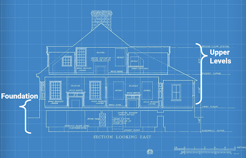

# Phase 1 Project Template - Minimum Viable Product (MVP)

This repository is like a blueprint, providing structure for your first End of Phase Project. We suggest you base your Phase 1 project off of this repository so you can focus less on formatting and organization, and more on the _analysis and communication skills_ that will support your progress through the course. This template is designed to make your project portfolio-ready in order to impress the future employers who will review it. 

## Repository Contents

Below is a list of the contents of this repository - instructions for using them are in the next section.

- `README.md`: The README for this repo branch explaining it's contents - you're reading it now
- `TEMPLATE_README.md`: An example of a project README that provides a brief overview of your whole project
- `dsc-phase1-project-template.ipynb`: A starter Jupyter Notebook with headings, code examples and guiding questions
- `DS_Project_Presentation_Template.pdf`: A starter slide deck presenting your project - here is an [editable version](https://docs.google.com/presentation/d/1PaiH1bleXnhiPjTPsAXQSiAK0nkaRlseQIr_Yb-0mz0/copy)
- `data` folder: A folder for the data you reference with your code
- `images` folder: A folder for the images you reference in your files 
- `.gitignore`: A hidden file that tells git to not track certain files and folders

## Instructions For Using This Repository

### Fork This Repository

**For a group project**, have only one team member do these steps:

1. Fork this repository to your personal account
   - In GitHub, go to this repository and click the "Fork" button in the upper right
   
2. Change the name of your fork of this repo to a _descriptive_ name of your choosing
   - In GitHub, go to your fork of this repo -> "Settings" -> "Options" -> "Repository Name" -> "Rename"
   - Make the name descriptive, since potential employers will read it. Ex: "Microsoft-Movie-Analysis" is better than "Project-1"

3. Use `git clone` to clone your fork of this repo to your local computer

4. **For a group project**, add team members as collaborators to your fork of this repo
   - In GitHub, go to your fork of this repo -> "Settings" -> "Manage Access" -> "Invite Teams or People"
   - Add your project team members as collaborators & send them the repo GitHub URL

### Work In Your Fork Of This Repository

- Work in the repo clone that you created on your local machine
- Start writing and coding in the Jupyter Notebook `dsc-phase1-project-template.ipynb`
- Fill in the README template in `TEMPLATE_README.md`
- Use `git add`, `git commit`, and `git push` often to update your repo in GitHub
   - For a refresher on how to do this and why it's important, review Topic 2: Bash and Git

### Use The Slide Template

1. Go to [this link](https://docs.google.com/presentation/d/1PaiH1bleXnhiPjTPsAXQSiAK0nkaRlseQIr_Yb-0mz0/copy) to make an editable copy of the slide deck in your own Google Drive account
2. Go to "Slide," select "Change Theme," and pick a theme you like so your presentation doesn't look like everyone else's
3. **For a group project**, click the "Share" button and add your teammates as editors

### Tidy Up Your Project

- Change the file name of the Jupyter Notebook (`dsc-phase1-project-template.ipynb`) to something more descriptive
- Save an appropriately-named PDF version of your slide deck to the repository
- Rename the template readme you've been working in by running `git mv TEMPLATE_README.md README.md`
- Delete unnecessary files from the repo using `git rm`
   - The presentation PDF: `DS_Project_Presentation_Template.pdf`
   - This README file: `README.md`
   - Any unused data files in the `data` folder
   - Any unused images in the `images` folder

### Submit Your Project

To submit your project, please follow the instructions in the "Project Submission & Review" page in the Milestones course.

***
### Notes

- The visualizations in the notebook use best practices for visualization that you should try to emulate. For example, they have clear axes, descriptive titles, and appropriate number formatting
- The `dsc-phase1-project-template.ipynb` is intended to be the _final version_ of your project. The first notebook you create will not look like this. You are encouraged to start with a very disorderly notebook and clean it as you go
