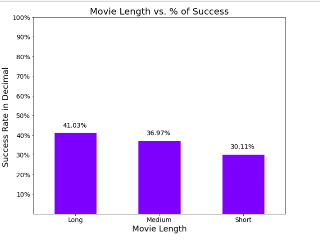
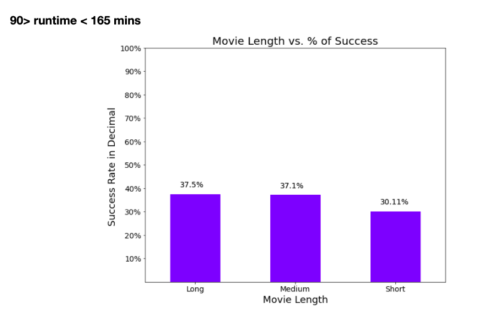
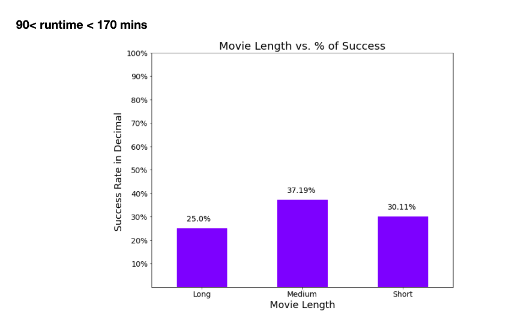
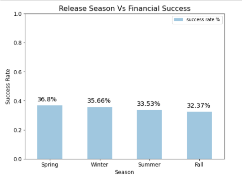
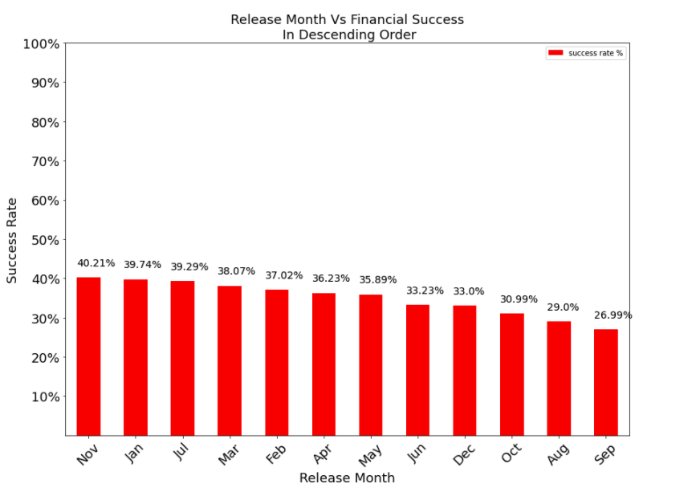
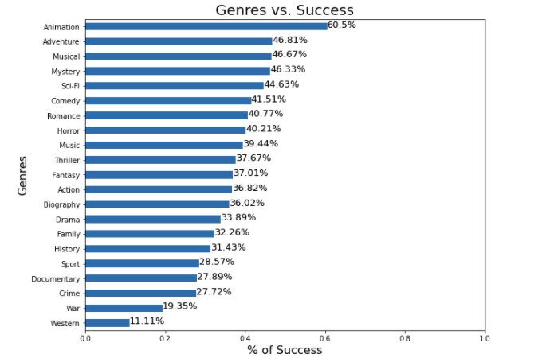
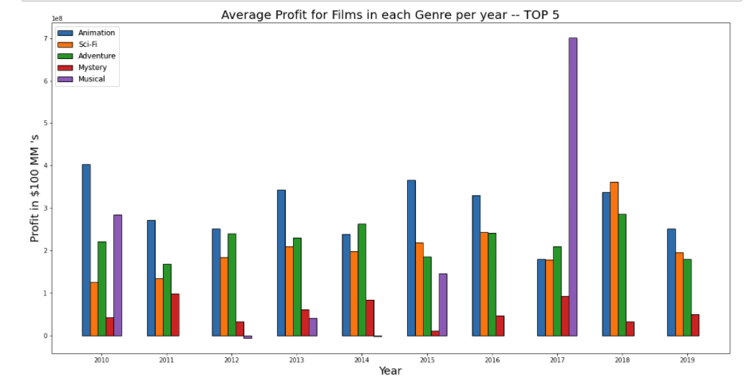
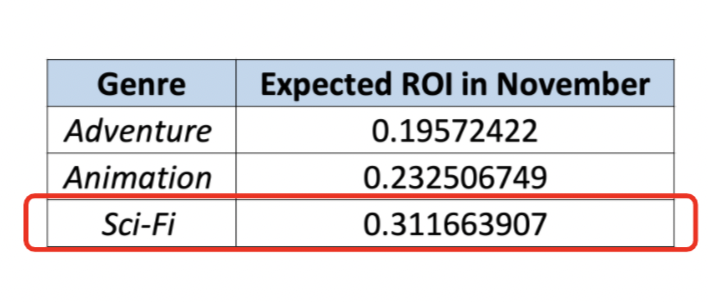

# Microsoft Studios Pitch 

**Authors**: Tony Bai, Douglas Lu, Sanjit Varma, Brett Zimmerman

## Overview

Microsoft is looking to break into original content film making by creating a new movie studio. Using data from online movie resource websites such as TMDB, The Numbers, and IMDB, our team analyzed historical data (focusing on "financial success") and its relationships compared to the time of film release, film genres, and film length to provide insights that can help guide Microsoft Studios in their new venture to become an industry leader down the road. Through merging of data frames and visual representations, our team was able to identify three distinct insights that Microsoft Studios should focus on: length of film, release window, and genre. 

## Business Problem

To help Microsoft Studios produce the next box-office movie, our team was tasked to analyze past box-office films to find insights and factors that contributed to a film’s success. We were then called upon to utilize any findings to formulate three actionable recommendations for Microsoft Studios. These three recommendations would serve as the Studio’s decision-making pillars when determining what type of film to produce. 

Given that Microsoft does not have a clear insight about what kind of movie to produce and that generating the maximal amount of profit is a big priority for the company and its shareholders and stakeholders, it is necessary for us to first identify what genre of film would be most successful. To begin this exploration, we must identify the genres that have historically had the highest success rate. For the purpose of this analysis, we will define success as a profit equivalent to 1.5 times the production budget. Upon gathering this information, we filter out the least successful genres and identify the most profitable genre based on historical evidence of the last decade. We will also look at the average budget to make a film in each genre to get a clearer picture of how much would be needed to spend. While identifying a genre of film to produce is helpful, it is also important to find the best time to release the film. This will be achieved by calculating the success % rate of films produced in each month. Success over here is again defined the same manner as mentioned earlier. And finally, we felt that a movie’s runtime is a major factor in affecting the audience's decision to watch a movie. Therefore, we will also explore if there is a correlation between a movie’s runtime and the profit it generates.

 

Questions to answer:

* Which genre has historically had the highest success rate?
* Which of the most successful genres has historically generated the highest profit?
* What are the average budgets for each genre?
* In which month have films historically been more successful?
* Is there a correlation between a movie’s runtime and its profit?

 

These questions are important to consider so that Microsoft can identify certain attributes of movies in recent years that made them successful. It would be helpful to identify what kind of genre would have a higher chance of generating the level of profit Microsoft may want. From a creative standpoint, it may be useful for film creators to learn what the optimal movie runtime to make a successful film is. When undergoing a big project like this, it is helpful to set a target deadline by when the film should be released. If we can find the best time of the year to release Microsoft’s inaugural release, it can help increase the likelihood of the production generating a profit.
  

## Data 

Describe the data being used for this project.

The data used in this project came from IMDB, TMDB, and The Numbers. The tables include data on movie titles, release dates, runtimes, ratings, and earnings. The movies included in the data range from 2010 to 2019. There are also columns added in with functions such as profit. The target variable is the most optimal movie to return a profit based on insights gathered about genre, runtime, and release month.
***

## Methods 

 Describe the process for analyzing or modeling the data. For Phase 1, this will be descriptive analysis.

After opening the raw datasets with pandas, we cleaned and prepared the data by converting some string data types to float, removing the rows of null values that prevented us from doing transformations, separating rows where a column has many values together, and merging datasets through key columns. Data was further cleaned by obtaining relevant subsets for the analysis performed.

Descriptive analysis was used through the use of bar graphs, scatter plots, and aggregate functions. Since the business problem is to identify the type of movie to make based on past data, we opted to identify trends using graphs.

***
Questions to consider:
* How did you prepare, analyze or model the data?
* Why is this approach appropriate given the data and the business problem?
***
 

## Results

<b>Recommendation 1</b>: The movie runtime should be between 90 and 165 minutes.

Based on our own assumption of success, which is when a movie’s profits exceed 1.5x the budget,  the success rate of movies is highest when the runtime falls between 90 and 165 minutes. The idea is based on the notion that many people don’t like sitting through longer movies. If we can avoid that, that's already a large audience that won’t be alienated. Our results were gathered by getting an aggregate of the success rate of movies in different time intervals. We first checked the success rate in movies grouped by a smaller time interval, and continued testing the outer bounds of that interval. The bucket of successful movies was shown to be the largest when the outer bound was capped at 165 minutes.  

 
 
***
 
 
 
   

<b>Recommendation 2</b>: The movie should be released in November.

Having found the optimal runtime for the movie, we started exploring the best time to release it. First, we took the release date of each film in the last 10 years from our dataset and started categorizing them into seasons- ”Spring”, ”Summer”, ”Fall”, ”Winter.” We decided to group the films this way because it is typical in the film industry to first identify the release season before finalizing the best release date later into production.  When grouping films seasonally and measuring the average success rate (based on the aforementioned assumption of success being 1.5x the production budget) of each group, we can see that the Spring season has the highest chance of success. However, we can also see that there isn’t a decisive winner in terms of which season generates the highest success rate- given that the second best season’s (Winter) success rate (35.66%) is only marginally behind that of the Spring season (36.8%).  

  

To get a more conclusive answer, we decided that we needed to segment our dataset of movie release dates into groups by month rather than by season. Having made this change, we now saw a more clear differentiation between groups. November, January and July were visibly clear winners. Finally, we recommend the month of November to be the ideal release date for a few important reasons.  
   

Firstly, November is a favorite month for several film studios that are looking to release films that generate buzz during the awards season. Releasing a high quality film right before the awards season may give Microsoft an opportunity to find themselves earning some of the most prestigious accolades in the business which would solidify the film’s credibility and therefore make it an asset that can generate revenue for several years into the future. Also, November is a season of festivities in the United States when discretionary expenditure is higher than average. Finally, our analysis also shows that November has the highest percentage chance of success -albeit marginally over January and July.   

<b>Recommendation 3</b>: The movie genre should be Sci-Fi

Staying consistent with our goal to return 1.5x budget, we analyzed the success rate of each film genre from our sample. The top 5 Categories were Animation, Adventure, Musical, Mystery and Sci-Fi. Although animation has a success rate of 60.5% which is ~14% higher than the next category, we decided to explore the data further. While Animation seems like a clear winner in this analysis, we decided that we must also consider budget factors before making the decision.  

   

Having found our top 5 categories (Animation, Adventure, Musical, Mystery, Sci-Fi) , we identified the average profit for each category in the last 10 years. Again, it can be seen that Animation is the clear winner in this analysis given that it highest profit generating genre in most years. However, we found that Adventure and Sci-fi films were also consistently generating the high profits on average over the last decade. Therefore, we selected the top 3 categories (Adventure, Animation and Sci-fi) for further analysis in order to finalize one genre.
 

   

Now that we had the profit for each genre, we calculated the return on investment for each of our top 3 genres (Adventure, Animation and Sci-fi). We then multiplied the respective ROI for each genre with the percentage success rate for a November release (calculated in the 2nd recommendation) as wells as the average percentage success rate for that respective genre. i.e. Expected ROI = ROI x (Average movie success rate in November %) x (Average success rate for the genre (past 10 years) %)

   
We calculated the expected ROI to factor in the percentage chance of movies succeeding in November as well as the percentage chance of a movie in that genre being successful. From this metric we found that the Sci-fi genre would have the highest “Expected ROI.” Therefore we recommend a Sci-fi movie as Microsoft’s first production.

