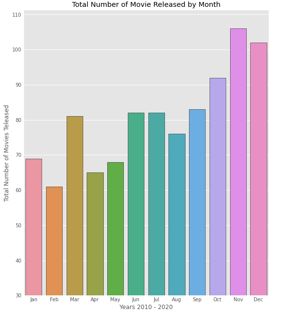

# Title

**Authors**: Doug Mill, Carlos McCrum, Seung Lee

## Overview

A one-paragraph overview of the project, including the business problem, data, methods, results and recommendations.

## Business Problem

Microsoft is looking to launch a movie, however they are unsure of the space. We are here to visualize what types of movies have been doing well historically and how Microsoft can replicate such success.


## Data

The dataset we are using (BigFrame) is derived from 'bom.movie_gross.csv', 'imdb.title.basics.csv', and 'tn.movie_budgets.csv'

BigFrame contains the columns 'release_date', 'movie', 'production_budget', 'worldwide_gross', 'foreign_gross', 'year', 'runtime minutes', and 'genres'. These columns should help us find out the formula to a great movie launch, if there is such a method.


## Methods

We first prepared the BigFrame by combining all the necessary tables together using a common attribute ('movie'). Next we dropped all unnecessary columns and removed any duplicate entries. We then created two columns 'month' and 'year' in order to manipulate the data using time. Lastly, we dropped the rows with missing data which left us with BigFrame of 977 rows. 


## Results

Releasing our film during May is ideal. History has shown that May returns the greatest revenue income for large production movies. With other movie competition not being so high in the beginning half of the year, May presents itself as the most ideal opportunity to debut our blockbuster film.

### Visual 1




May is historically the best month for large movie productions, so we should aim to debut our film then.
Combined with the relatively low volume, there is no better time in the year.


## Conclusions

Any skepticism in our data or how we could further explore our dataset (more potentially relevant comparisons)

***
Questions to consider:
* What would you recommend the business do as a result of this work?
* What are some reasons why your analysis might not fully solve the business problem?
* What else could you do in the future to improve this project?
***

## For More Information

Please review our full analysis in [our Jupyter Notebook](./dsc-phase1-project-template.ipynb) or our [presentation](./DS_Project_Presentation.pdf).

For any additional questions, please contact **name & email, name & email**

## Repository Structure

Describe the structure of your repository and its contents, for example:

```
├── README.md                           <- The top-level README for reviewers of this project
├── dsc-phase1-project-template.ipynb   <- Narrative documentation of analysis in Jupyter notebook
├── DS_Project_Presentation.pdf         <- PDF version of project presentation
├── data                                <- Both sourced externally and generated from code
└── images                              <- Both sourced externally and generated from code
```
