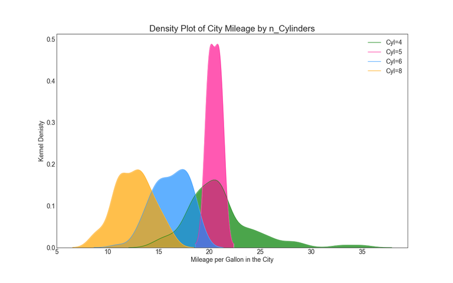

# Titlle that recommends an action
## Subtitle describing the analysis 

**Authors**: Student1, StudentQ, Student_Other

The contents of this repository detail an analysis of the module one project. This analysis is detailed in hopes of making the work accessible and replicable.


### Business problem:

Here is where you state the business problem you were trying to solve


### Data
Data can include source and high-level description (e.g. # obs)


## Methods
- descriptive analysis
- choices made
- key relevant findings from exploritory data analysis for mod 1, will be more involved in future mod

## Results
### Here are examples of how to embed images from your sub-folder
#### Visual 1


#### Visual 2



## Recommendations:


## Limitations & Next Steps


### For further information
Please review the narrative of our analysis in [our jupyter notebook](./dsc-mod1-project-template.ipynb) or review our [presentation](./SampleProjectSlides.pdf)

For any additional questions, please contact **email, email, email)


##### Repository Structure:

Here is where you would describe the structure of your repoistory and its contents, for exampe:

```

├── __init__.py                     <- .py file that signals to python these folders contain packages.
├── README.md                       <- The top-level README for reviewers of this project.
├── dsc-mod1-project-template.ipynb <- narrative documentation of analysis in jupyter notebook
├── presentation.pdf                <- pdf version of project presentation
├── data
│   ├── README.md                       <- lower-level README describing the data sources provided
│   ├── file_1                          <- sample data file
│   ├── file_2                          <- sample data file
│   └── file_3                          <- yet another sample data file
├── data_cleaning_code
│   ├── __init__.py                     <- .py file that signals to python these folders contain packages.
│   └── data_cleaning.py                <- .py script used to pre-process and clean data
└── images_and_code
    ├── __init__.py                     <- .py file that signals to python these folders contain packages.
    ├── visualizations.py               <- .py script to create finalized versions of visuals for project
    └── images                          <- both sourced externally and generated from code

```


