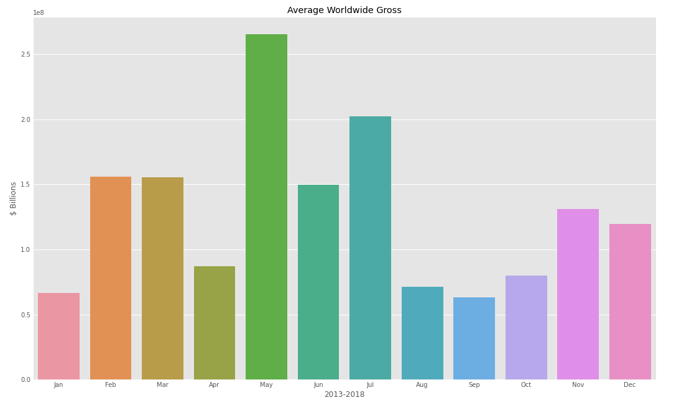

# Title

**Authors**: Student1, Student2

## Overview

A one-paragraph overview of the project, including the business problem, data, methods, results and recommendations.

## Business Problem

Summary of the business problem you are trying to solve, and the data questions that you plan to answer in order to solve them.

***
Questions to consider:
* What are the business's pain points related to this project?
* How did you pick the data analysis question(s) that you did?
* Why are these questions important from a business perspective?
***

## Data

The dataset we are using (BigFrame) is derived from 'bom.movie_gross.csv', 'imdb.title.basics.csv', and 'tn.movie_budgets.csv'

BigFrame contains the columns 'release_date', 'movie', 'production_budget', 'worldwide_gross', 'foreign_gross', 'year', 'runtime minutes', and 'genres'. These columns should help us find out the formula to a great movie launch, if there is such a method.

***
Questions to consider:
* Where did the data come from, and how do they relate to the data analysis questions?
* What do the data represent? Who is in the sample and what variables are included?
* What is the target variable?
* What are the properties of the variables you intend to use?
***

## Methods

We first prepared the BigFrame by combining all the necessary tables together using a common attribute ('movie'). Next we dropped all unnecessary columns and removed any duplicate entries. We then created two columns 'month' and 'year' in order to manipulate the data using time. Lastly, we dropped the rows with missing data which left us with BigFrame of 977 rows. 


***
Questions to consider:
* How did you prepare, analyze or model the data?
* Why is this approach appropriate given the data and the business problem?
***

## Results

Releasing our film during May is ideal. History has shown that May returns the greatest revenue income for large production movies. With other movie competition not being so high in the beginning half of the year, May presents itself as the most ideal opportunity to debut our blockbuster film.

***
Questions to consider:
* How do you interpret the results?
* How confident are you that your results would generalize beyond the data you have?
***

Here is an example of how to embed images from your sub-folder:

### Visual 1



## Conclusions

Provide your conclusions about the work you've done, including any limitations or next steps.

***
Questions to consider:
* What would you recommend the business do as a result of this work?
* What are some reasons why your analysis might not fully solve the business problem?
* What else could you do in the future to improve this project?
***

## For More Information

Please review our full analysis in [our Jupyter Notebook](./dsc-phase1-project-template.ipynb) or our [presentation](./DS_Project_Presentation.pdf).

For any additional questions, please contact **name & email, name & email**

## Repository Structure

Describe the structure of your repository and its contents, for example:

```
├── README.md                           <- The top-level README for reviewers of this project
├── dsc-phase1-project-template.ipynb   <- Narrative documentation of analysis in Jupyter notebook
├── DS_Project_Presentation.pdf         <- PDF version of project presentation
├── data                                <- Both sourced externally and generated from code
└── images                              <- Both sourced externally and generated from code
```
